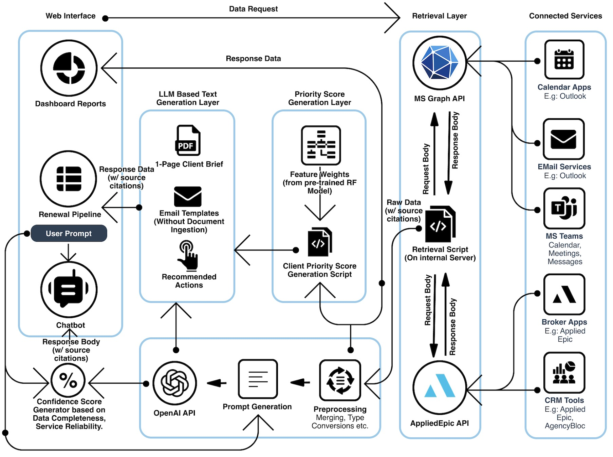

# ApexRenew: Insurance Broker CoPilot

## Description
This is a project part of the Broker Co-Pilot Challenge of `IIT-Bombay TechFest 2025`. This tool is hosted as a website and provides a common platform for insurance brokers to view all their clients and associated information in a systematic manner. The tools broadly constitute:
1. A Renewal Pipeline with all clients prioritized 
2. AI based chatbot that assists the user in closing renewals.
3. A dashboard that shows brief updates and metrics to the user.

## Problem at Hand
Insurance broker agents have to juggle between multiple platforms (CRM platform like AppliedEpic, team collaboration platforms like MS Teams) as a part of their work in handling renewals. This begets a need for a unified platform that retrieves the data from these primary platforms and provides them to the user to make informed decisions. The idea is to minimise time wasted on tool usage and maximize broker renewal productivity.

## Solution Architecture

## Installation/Setup instructions
(GPT based features like breif generation and Connector based QNA will not work without OpenAI API key)
1. In the Project Folder `ApexRenew/`, create a venv:
   > python3 -m venv venv
2. Install all Requirements 
   > python3 install -r requirements.txt
3. Add your OpenAI API key to `ApexRenew/textGenerator.py`
3. Start up the APIs for CRM and collaboration platforms:
   After switching to the `FastAPI_Scripts` folder:
   > uvicorn ColabAPI:app --port 8001
   
   > uvicorn CRMAPI:app --port 8000
4. Open the web app
   After switching to the `ApexRenew` folder:
   > streamlit run ApexRenew.py --server.port 8002

## Security Notes
- user has to log in into Mock Applied Epic and MS Teams platforms to access the data.
- The OAuth 2.0 tokens received are stored in `streamlit.session_state`
- The No document ingestion, RAG or embeddings/vector DB was used.
- All data being used is retireved from the connected services through the [connector script](retrieval.py)
- Connector QNA features involves appending a portion of the dataset into the prompt itself only upon implicit request.

## Evaluation Results

**Integration Coverage:** Connected to `2 services`:
   - MS Graph API* (MS Teams, E-Mails, Messages, Calendar Events etc.)
   - Applied Epic API* (Insurance Broker CRM platform)

**Accuracy of QNA Answers:** Average answer accuracy of ~85%
   - calcualted using `Facebook BART` LLM, performing Zero Shot Classification.
   - assesses data accuracy and response relevance
  
  **Broker Time Savings:** ~`2-4 hours` saves per day
   - no need to juggle between platforms
   - AI assisted workflow (negotiation recommendations, QNA etc.)
   - Editable Template Based Communication
   - Quick Decision Making
  
  **Prioritization Explainability** `ClientPriorityGPA` is a highly interpretable weighetd average.
   - justification for any GPA can be viewed using the `JustifyGPA feature` in Renewal Tab of the web app
   - factors influencing ClientPriorityGPA:
     - time to expiry
     - premium at risk
     - past performance of client
     - past performance of carrier
     - client churn likelihood
   - each factor scored out of 10 
   - weighted average of scores calculated
   - weight for each factor derived using `feature importances` from trained Random Forest Model: [Script](models\churn_predictor.ipynb)
   - A score can be justified as being low or high based on values of corresponding factor scores. (Justify Feature on Renewal Pipeline tab of web app)

   **Feedback from pilot testing**
   - The web app is super fast with very almost no bugs.
   - All feaures required by the PS are availble and functional
   - OpenAI API based Chatbot (Connector based QNA and Brief PDF Generation) are really amazing and truly helpful.
   - The template-based emails are also pretty useful.